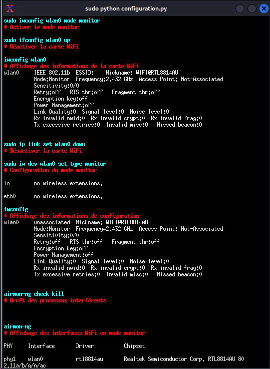
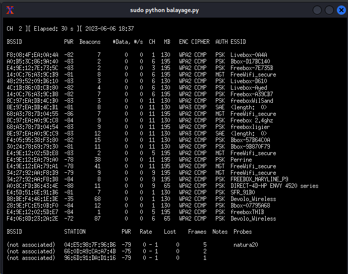

# fragAttacksCyber2

# 1. Introduction

FragAttacks (attaques de fragmentation et d'agrégation) est un ensemble de nouvelles vulnérabilités de sécurité qui affectent les appareils Wi-Fi. 

Un adversaire qui se trouve à portée du réseau Wi-Fi d'une victime peut abuser de ces vulnérabilités pour voler des informations utilisateur ou attaquer des appareils. 

Trois des vulnérabilités découvertes sont des défauts de conception dans la norme Wi-Fi et affectent donc la plupart des appareils. 

En plus de cela, plusieurs autres vulnérabilités ont été découvertes, causées par des erreurs de programmation généralisées dans les produits Wi-Fi. 

Les expériences indiquent que chaque produit Wi-Fi est affecté par au moins une vulnérabilité et que la plupart des produits sont affectés par plusieurs vulnérabilités.

Les vulnérabilités découvertes affectent tous les protocoles de sécurité modernes du Wi-Fi, y compris la dernière spécification WPA3. 

Même le protocole de sécurité d'origine du Wi-Fi, appelé WEP, est affecté. Cela signifie que plusieurs des failles de conception nouvellement découvertes font partie du Wi-Fi depuis sa sortie en 1997!

Le but de ce projet est de simuler une attaque de type FragAttacks sur WPA2 ou WPA3.

# 2.  Cartes réseau prises en charge

Seules des cartes réseau sans fil spécifiques sont prises en charge. 

Cela est dû au fait que certaines cartes réseau peuvent écraser la séquence ou le numéro de fragment des trames injectées, ou peuvent réorganiser les trames de différentes priorités, ce qui interfère avec l'outil de test (c'est-à-dire que l'outil pourrait indiquer qu'un appareil est sécurisé alors qu'il ne l'est pas).

Les cartes réseau suivantes fonctionnent correctement :


|      Network Card      | USB | 5GHz |        mixed mode       |      injection mode     |
| ---------------------- | --- | ---- | ----------------------- | ----------------------- |
| Technoethical N150 HGA | Yes | No   | patched driver/firmware | patched driver/firmware |
| TP-Link TL-WN722N v1.x | Yes | No   | patched driver/firmware | patched driver/firmware |
| Alfa AWUS036NHA        | Yes | No   | patched driver/firmware | patched driver/firmware |
| Intel Wireless-AC 8265 | No  | Yes  | patched driver          | yes                     |
| Intel Wireless-AC 3160 | No  | Yes  | patched driver          | yes                     |
| Alfa AWUS036ACM        | Yes | Yes  | patched driver          | yes                     |
| Netgear WN111v2        | Yes | No   | patched driver          | yes                     |
| Alfa AWUS036ACH        | Yes | Yes  | no                      | yes                     |

Les deux dernières colonnes signifient :

    Mode mixte : indique si la carte réseau peut être utilisée dans le mode mixte recommandé.

    Mode d'injection : indique si la carte réseau peut être utilisée comme une seconde interface pour injecter des trames dans le mode d'injection.

Oui indique que la carte fonctionne en mode natif dans le mode spécifié. Patched driver/firmware
signifie que la carte est compatible lorsqu'elle est utilisée avec des pilotes et/ou un micrologiciel patchés.
Non signifie que ce mode n'est pas pris en charge par la carte réseau.

Je recommande d'utiliser l'outil de test en mode mixte.

Notez que les périphériques USB peuvent être utilisés à l'intérieur d'une machine virtuelle, et les pilotes et/ou micrologiciels modifiés
peuvent être installés dans cette machine virtuelle. Cependant, j'ai constaté que l'utilisation de machines virtuelles peut
rendre les cartes réseau moins fiables, et je recommande plutôt l'utilisation d'une image USB live si vous ne pouvez pas
installer les pilotes/micrologiciels modifiés nativement.

    Le AWUS036ACM en mode mixte semble fiable avec nos derniers pilotes et c'est celui que je recommande. Un appareil moins cher mais presque identique est celui avec une puce MT7612U. Voir plus d'informations ici.

    J'ai précédemment recommandé le Technoethical N150 HGA en mode mixte. Ce dongle est identique au TP-Link TL-WN722N v1.x et nécessite l'utilisation de pilotes et de micrologiciels modifiés. Il s'agit de l'un des dongles les plus testés, mais il est difficile à trouver. C'est pourquoi je recommande maintenant le AWUS036ACM à la place.

    Les Intel 3160 et 8265 sont pris en charge et ont été largement testés. Parfois, leur micrologiciel plante, mais un redémarrage rend la carte réseau utilisable à nouveau. L'Intel AX200 n'est pas compatible avec l'outil de test.

    Le WN111v2 semble bien fonctionner, bien que je ne l'ai pas testé de manière approfondie.

    Le pilote pour le AWUS036ACH ne fait pas partie du noyau Linux et nécessite l'installation d'un pilote séparé. Sur Kali, vous pouvez installer ce pilote via le gestionnaire de paquets. Cette carte n'a pas été testée de manière approfondie.

Si vous ne parvenez pas à trouver l'une des cartes réseau mentionnées ci-dessus, vous pouvez rechercher des cartes réseau alternatives qui ont également de fortes chances de fonctionner. 

Lors de l'utilisation d'une carte réseau qui n'est pas explicitement prise en charge, je recommande fortement d'exécuter d'abord les tests d'injection avant de l'utiliser, et d'utiliser l'outil contre une implémentation connue vulnérable pour confirmer que l'outil fonctionne correctement.

# 2.  Configuration

    run_command('ifconfig', '# Affichage de la configuration de l\'interface')
    Cette commande exécute la commande système ifconfig pour afficher la configuration de l'interface réseau. Le commentaire indique qu'il s'agit de l'affichage de la configuration de l'interface.

    run_command('iwconfig', '# Affichage de la puissance de la carte WiFi')
    Cette commande exécute la commande système iwconfig pour afficher la puissance de la carte Wi-Fi. Le commentaire indique qu'il s'agit de l'affichage de la puissance de la carte Wi-Fi.

    run_command('lsusb', '# Affichage de la liste des périphériques USB')
    Cette commande exécute la commande système lsusb pour afficher la liste des périphériques USB connectés. Le commentaire indique qu'il s'agit de l'affichage de la liste des périphériques USB.

    run_command('lsusb -vs 001:002', '# Affichage des informations détaillées du dongle WiFi')
    Cette commande exécute la commande système lsusb -vs 001:002 pour afficher les informations détaillées du dongle Wi-Fi. Le commentaire indique qu'il s'agit de l'affichage des informations détaillées du dongle Wi-Fi.

    run_command('ethtool -i wlan0', '# Affichage des informations de la carte WiFi')
    Cette commande exécute la commande système ethtool -i wlan0 pour afficher les informations de la carte Wi-Fi. Le commentaire indique qu'il s'agit de l'affichage des informations de la carte Wi-Fi.

    run_command('sudo ifconfig wlan0', '# Désactiver la carte WiFi')
    Cette commande exécute la commande système sudo ifconfig wlan0 pour désactiver la carte Wi-Fi. Le commentaire indique qu'il s'agit de la désactivation de la carte Wi-Fi.

    run_command('sudo iwconfig wlan0 mode monitor', '# Activer le mode monitor')
    Cette commande exécute la commande système sudo iwconfig wlan0 mode monitor pour activer le mode moniteur de la carte Wi-Fi. Le commentaire indique qu'il s'agit de l'activation du mode moniteur.

    run_command('sudo ifconfig wlan0 up', '# Réactiver la carte WiFi')
    Cette commande exécute la commande système sudo ifconfig wlan0 up pour réactiver la carte Wi-Fi. Le commentaire indique qu'il s'agit de la réactivation de la carte Wi-Fi.

    run_command('iwconfig wlan0', '# Affichage des informations de la carte WiFi')
    Cette commande exécute la commande système iwconfig wlan0 pour afficher les informations de la carte Wi-Fi. Le commentaire indique qu'il s'agit de l'affichage des informations de la carte Wi-Fi.

    run_command('sudo ip link set wlan0 down', '# Désactiver la carte WiFi')
    Cette commande exécute la commande système sudo ip link set wlan0 down pour désactiver la carte Wi-Fi. Le commentaire indique qu'il s'agit de la désactivation de la carte Wi-Fi.

    run_command('sudo iw dev wlan0 set type monitor', '# Configuration du mode monitor')
    Cette commande exécute la commande système sudo iw dev wlan0 set type monitor pour configurer le mode moniteur de la carte Wi-Fi. Le commentaire indique qu'il s'agit de la configuration du mode moniteur.

    run_command('iwconfig', '# Affichage des informations de configuration')
    Cette commande exécute la commande système iwconfig pour afficher les informations de configuration. Le commentaire indique qu'il s'agit de l'affichage des informations de configuration.

    run_command('airmon-ng check kill', '# Arrêt des processus interférents')
    Cette commande exécute la commande système airmon-ng check kill pour arrêter les processus interférents avec la carte Wi-Fi. Le commentaire indique qu'il s'agit de l'arrêt des processus interférents.

    run_command('airmon-ng', '# Affichage des interfaces WiFi en mode monitor')
    Cette commande exécute la commande système airmon-ng pour afficher les interfaces Wi-Fi en mode moniteur. Le commentaire indique qu'il s'agit de l'affichage des interfaces Wi-Fi en mode moniteur.

    run_command('aireplay-ng --test wlan0', '# Exécution du test avec aireplay-ng')
    Cette commande exécute la commande système aireplay-ng --test wlan0 pour exécuter le test avec aireplay-ng sur la carte Wi-Fi. Le commentaire indique qu'il s'agit de l'exécution du test avec aireplay-ng.






# 3. Lancement

```shell
./launch.sh

